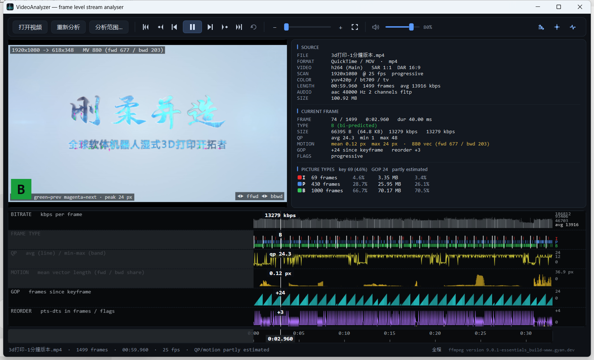
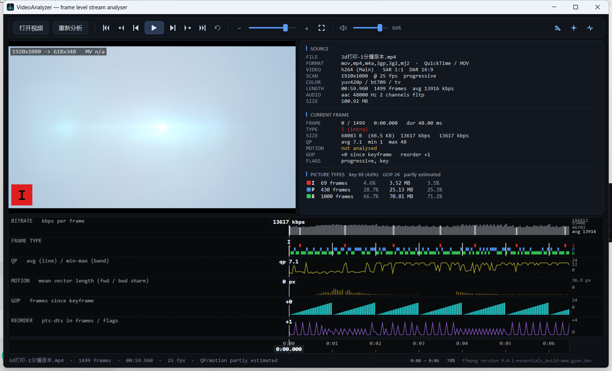
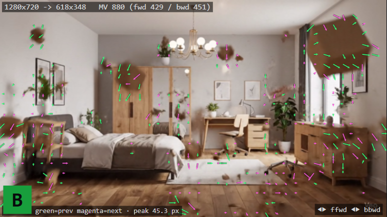
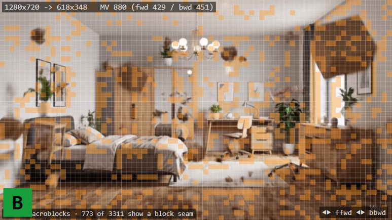
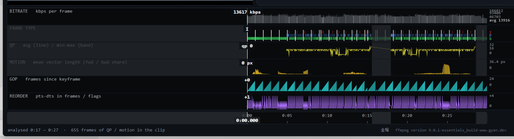

# VideoAnalyzer

**A frame-level video stream analyser for Windows** — it decodes a file, builds a per-frame
record of the encoded stream, and plots that record as a stack of synchronised graphs, so
compression and mastering problems can be seen at a glance. Built in the spirit of
[QCTools](https://bavc.github.io/qctools/), on top of **ffmpeg**.

**English** | [简体中文](README.zh-CN.md)




---

## What it is

A video file is a stream of decisions an encoder made: how many bits each frame got, which
frames are key frames, where it spent its quantiser, which blocks it predicted from where.
Those decisions are invisible when you just watch the picture, and they are what you have to
look at when the picture is wrong.

VideoAnalyzer makes them visible. Pick a file and it decodes it in stages — container, packet
table, picture types, quantiser, motion — publishing each stage the moment it has it. **The
transport opens about 0.4 s after a file is picked and you can play while the rest of the
analysis continues**; the graphs fill in underneath as it goes.

Everything goes through ffmpeg, so a file ffmpeg can read is a file this can analyse. There are
no third-party libraries: the whole application is .NET 8 + WPF.

---

## Features

| | |
|---|---|
| **Six synchronised graphs** | Bitrate, picture type, QP, motion, GOP position and reorder distance, all on one timeline under one playhead |
| **Pinned playhead** | The playhead is held in the middle and the data travels under it — the values under it stay put while you watch |
| **Frame-accurate playback** | Decoded through an ffmpeg `rawvideo` pipe into a `WriteableBitmap`: exact frame stepping, no `MediaElement` limits |
| **Analyser overlays** | Motion vectors, block-noise dots and a macroblock grid, drawn over the picture |
| **Scrub preview** | Dragging shows an instant thumbnail from a pre-built filmstrip; exactly one real seek runs on release |
| **Audio** | Raw PCM through `waveOut`, software volume, measured A/V offset ~0.2 s |
| **Live frame record** | Type, size, QP, motion, GOP position, reorder delta and flags for the frame under the playhead |
| **Full screen** | Double-click the picture and the window hands itself over to the video |
| **Part of a clip** | Mark or type a range and only that stretch is decoded; ranges accumulate, and the time between them is shaded as unmeasured |
| **Stoppable analysis** | 取消分析 stops the deep passes and keeps everything they had already produced |

### The graph stack



*Zoomed in: the playhead is pinned in the centre, the data scrolls underneath it, and the ruler
only labels where the clip actually is. The rows are drawn in two cached layers, so scrolling
costs one blit per frame rather than a re-render of every bar.*

| Row | What it shows |
|---|---|
| **BITRATE** | Bits per frame on a log₂ scale, with the clip average; key frames are drawn brighter |
| **FRAME TYPE** | One lane per picture type (I / P / B), key frames marked as vertical lines |
| **QP** | Quantiser: the average as a line, the per-frame min–max as a band |
| **MOTION** | Mean motion-vector length per frame, forward / backward share |
| **GOP** | Frames since the last key frame — the shape of each GOP |
| **REORDER** | PTS−DTS in frames, with corrupt / discard / interlaced / repeat flags on the baseline |

### Overlays

| Motion vectors | Macroblock grid |
|---|---|
|  |  |
| Every block is matched against both neighbours and the better match wins; **green** = matched the previous frame, **magenta** = the next, and the arrows point the way the content travels. The banner reports the vector count and the split, the legend the peak length in source pixels. | The encoder's 16×16 block boundaries at their **real pitch**, with the blocks whose edges stand out washed amber — a seam the encoder failed to hide. The legend counts how many of the frame's blocks were flagged. |

The **block-noise** overlay dots the blocks that carry detail, and the macroblock grid
deliberately does not appear over the motion vectors: the arrows already show the block
structure.

---

## Analysis pipeline

Each stage publishes as soon as it has results, so the app is usable long before it is finished.

| Stage | Cost (60 s 1080p) | Feeds |
|---|---|---|
| 1. Probe | ~0.4 s | info panel, transport |
| 2. Packet scan | ~0.7 s | bitrate, GOP, reorder |
| 3. Picture types + QP | ~12 s | frame type, QP |
| 4. Motion field | ~17 s | motion graph, vector overlay |

1. **Probe** — `ffprobe -show_format -show_streams`: container, codec, resolution, frame rate,
   colour tags, SAR/DAR, audio layout.
2. **Packet scan** — `ffprobe -show_packets` reads the container's packet table without decoding:
   size, pts, dts and the key / discard / corrupt flags. Key frames are marked as intra frames
   here; the rest arrive with stage 3.
3. **Picture types + QP** — one `ffmpeg -debug qp` decode yields both the picture type of every
   frame (packets do not carry it) and the real per-macroblock quantiser. Where ffmpeg cannot
   dump it, the value is derived from bits-per-pixel and flagged `(est.)` in the UI.
4. **Motion** — `-debug mv` output when the decoder actually provides vectors, otherwise a
   built-in block matcher: the clip is decoded to a 320 px greyscale stream and every 8×8 block
   is matched against both neighbours with a predicted spiral SAD search.

Stages 3 and 4 **run at the same time** — separate decoders, different fields of each frame
record — so the deep pass costs the slower of the two rather than their sum. Both publish as
they go, so the graphs fill in while the analysis is still running.

### Analysing part of a clip

The deep passes take a range, which is what makes a two hour recording workable: mark a stretch
on the ruler (right-click twice) or type the two times in, and only that part is decoded. The
passes are handed a seek and a duration and the parsed results are shifted back onto the whole
frame table — with **two different offsets**, because a `-debug qp` dump also covers the key
frame the decoder had to start from while a rawvideo pipe only carries what ffmpeg decided to
output. Gap filling and type inference are clamped to the same range, so nothing outside it is
invented.

Ranges accumulate: analysing 5–15 s and then 18–28 s leaves both in the frame table, and the
graphs shade the gap between them — the shading follows the contiguous runs of frames that
actually carry data rather than the outermost pair, so an unmeasured stretch is never painted as
done. Bitrate, GOP and reorder come from the packet table and always cover the whole file, so
those rows are never shaded.



*Two ranges analysed one after the other on a 60 s clip: the QP and motion rows carry data in
5–15 s and 18–28 s, and the time between them is shaded because nothing has been measured there.
The three packet-table rows above and below are untouched.*

A pass can be stopped part way, and what it had already produced stays usable. Results are also
held in memory for the files opened most recently, so switching back to one does not decode it
again; nothing is written to disk.

---

## Requirements

* **Windows 10 / 11** (x64)
* **.NET 8 Desktop Runtime** — [download](https://dotnet.microsoft.com/download/dotnet/8.0)
* **ffmpeg and ffprobe**, any recent build — [gyan.dev](https://www.gyan.dev/ffmpeg/builds/) or
  [BtbN builds](https://github.com/BtbN/FFmpeg-Builds/releases)

ffmpeg is looked up in this order, so any one of these works:

1. the `FFMPEG_HOME` environment variable
2. `tools\ffmpeg\bin\` beside the executable, or in any of the nine parent directories
3. anything one folder down inside `tools/` at those levels — an unpacked build keeps whatever
   name the archive had, `ffmpeg-9.0.1-essentials_build` being the usual one
4. anywhere on `PATH`
4. the usual install locations (`C:\ffmpeg\bin`, chocolatey, WinGet links)

If nothing is found the app offers a file picker on startup. The simplest setup is to unpack a
build into `tools\ffmpeg\bin\` next to `VideoAnalyzer.exe`.

---

## Getting started

Releases carry two builds:

| Download | What it needs |
|---|---|
| `VideoAnalyzer-<version>-win-x64.zip` | the program on its own — the .NET 8 desktop runtime and a copy of ffmpeg |
| `VideoAnalyzer-<version>-win-x64-with-ffmpeg.zip` | self contained, ffmpeg included: unpack it and run |


```bash
git clone https://github.com/z13660/VideoAnalyzer.git
cd VideoAnalyzer
./build.sh              # or: cd src/VideoAnalyzer && dotnet build
```

Then run `src/VideoAnalyzer/bin/Debug/net8.0-windows/VideoAnalyzer.exe [video]`.

To produce a distributable copy:

```bash
dotnet publish src/VideoAnalyzer -c Release -r win-x64 --self-contained false -o publish
```

> **Why `build.sh` exists.** The agent shell this project was developed in launches with an
> incomplete Windows environment. NuGet resolves its machine-wide configuration through
> `PROGRAMFILES(X86)` / `PROGRAMFILES`, and when those are absent restore dies with
> `Value cannot be null. (Parameter 'path1')`. The script supplies the standard variables before
> calling `dotnet`. From a normal terminal, `dotnet build` works on its own.

---

## Controls

| Key | Effect |
|---|---|
| `Ctrl+O` | Open a video (a file can also be dropped onto the window, or passed as an argument) |
| `Space` | Play / pause |
| `←` / `→` | Previous / next frame |
| `Ctrl+←` / `Ctrl+→` | Previous / next key frame |
| `↑` / `↓` | Volume up / down |
| `Ctrl+M` | Mute |
| `Ctrl+L` | Toggle loop playback |
| `Home` / `End` | Jump to start / end |
| `Ctrl+0` | Fit the whole clip in the strip |
| `+` / `-` | Zoom the time view |
| `Esc` | Leave full screen |

| Mouse | Effect |
|---|---|
| Click a graph or the timeline | Seek to the point clicked |
| Drag a graph or the timeline | Scrub — the strip is grabbed and the content travels with the cursor |
| Right-click the timeline | Mark an analysis range: the first click sets the start, the second sets the end and analyses that stretch. Another right-click starts a new range, and the earlier results stay |
| 分析范围… | Type the two times instead; the dialog opens on the visible range, and 用当前视图 puts it back |
| 取消分析 | Stop the deep passes and keep what they have already produced |
| Wheel over a graph or the timeline | Zoom around the cursor |
| Double-click the picture | Full screen; double-click again (or `Esc`) to leave |

Playing to the end and pressing play again starts from the top. Seeking while playing keeps
playing.

---

## Layout

```
src/VideoAnalyzer/
  App.xaml(.cs)              application entry point
  MainWindow.xaml(.cs)       layout, transport, keyboard, drag & drop, full screen
  Models/                    MediaInfo, FrameInfo, AnalysisResult, MotionField
  Services/
    FfmpegLocator.cs         finds the toolchain, reads its version
    MediaProbeService.cs     container / stream metadata
    PacketScanService.cs     packet table sweep
    DeepAnalysisService.cs   QP + motion passes, estimator fallback
    MotionEstimator.cs       built-in block matcher
    BlockAnalysis.cs         block activity, blocking ratios, blockiness
    VideoPlaybackEngine.cs   rawvideo pipe playback, frame-accurate seek
    AudioPlayer.cs           PCM through waveOut
    Filmstrip.cs             thumbnail strip for the scrub preview
    AnalysisService.cs       pipeline orchestration
  Controls/
    FrameGraph.cs            cached graph renderer (6 kinds)
    TimelineStrip.cs         time ruler + playhead
    VideoSurface.cs          picture + overlays
  ViewModels/MainViewModel.cs
  Themes/Dark.xaml
tools/                       verification and capture helpers (Python)
```

## Notes on the design

* **The playhead is pinned, and the view is not clamped to the clip.** Keeping the playhead
  centred on the first and the last frame means showing time before the first frame and after
  the last; the ruler stops labelling where the clip stops, so the blank part never reads as a
  longer file than the one that is loaded.
* **Graphs are drawn in two cached layers.** The static layer (background, title, axis labels)
  changes only with the row size or the data; the data layer is rendered for a range reaching
  40 % of a span past each edge and blitted at a pixel-snapped offset. A scrolling playhead
  costs one blit per frame, and the layer is rebuilt only once the view has travelled that far.
* **Frames are placed by time, not by count.** Each frame's mark is derived from its own
  presentation time, so a view that runs past the end of the clip leaves the space empty instead
  of stretching the data to fill the pane.
* **The video pane is self-drawn.** A `MediaElement` would not allow per-frame stepping or
  overlays, so decoding runs through an ffmpeg `rawvideo` pipe into a `WriteableBitmap`. Seeking
  restarts ffmpeg with an input `-ss`, which lands on the preceding key frame and discards
  forward.
* **Dragging previews, releasing seeks.** A seek costs a decoder restart, so a drag only shows
  the nearest thumbnail from a filmstrip of ~240 frames decoded in one background pass; exactly
  one real seek runs on release.
* **The end of playback is taken from the decoder, not the frame index.** A container's packet
  table can list more frames than the decoder emits, and the transport would otherwise stay
  stuck in "playing" on the last decodable frame.
* **Streaming updates are coalesced.** The pipeline publishes batches from background threads and
  the window refreshes at most ~8 times a second, so a fast pass cannot starve the UI.
* **The output device is kept warm.** Opening a `waveOut` stream costs about 1.5 s the first
  time; feeding it silence as soon as a file loads brings the first play down to the same
  ~0.2 s as later ones.

## Known limitations

* QP is decoder-exact only where ffmpeg's `-debug qp` supports the codec; otherwise it is an
  estimate, flagged in the UI.
* The built-in motion estimator is a real block matcher, not the encoder's own decisions, so on
  flat synthetic footage the vectors are legitimately near zero.
* The full motion field is kept per frame (~2.6 KB/frame at 320 px wide with 8 px blocks) and the
  filmstrip holds ~240 thumbnails, so a long clip costs a few tens of MB during analysis.
* Audio is decoded at a fixed 48 kHz stereo 16-bit and there is no audio *analysis* — no
  loudness or level metering, only playback.
* A range pass finishes a frame or two short of its end: the decoder is stopped by the duration
  it was given, so the last frame's QP comes from gap filling rather than from the dump. The band
  looks right; only the current-value readout on that one frame is approximate.
* Windows only: the playback engine, audio output and window chrome are Win32/WPF specific.

## License

MIT — see [LICENSE](LICENSE).

---

**English** | [简体中文](README.zh-CN.md)
